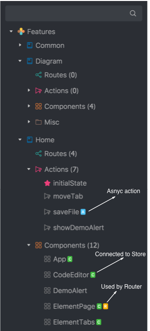
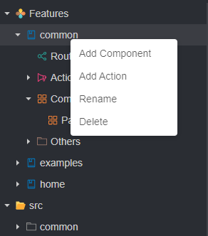
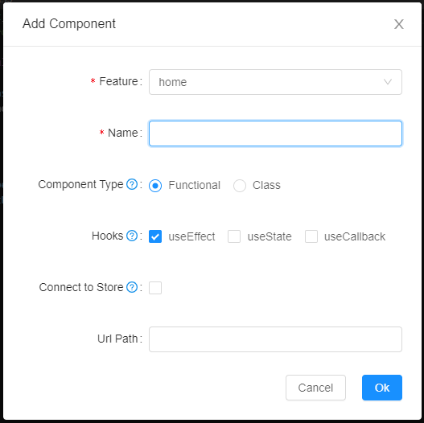
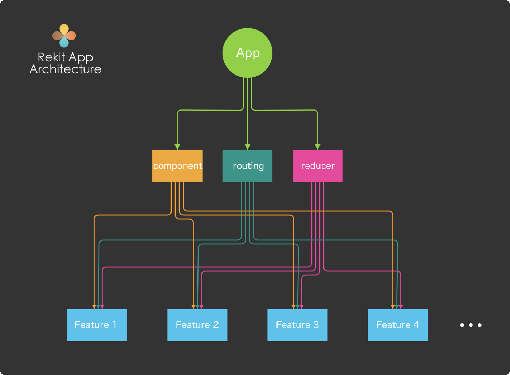

# rekit 3

## 快速开始

### 安装

```
npm install -g rekit
npm install -g rekit-studio@next
```

rekit 3 中 rekit-studio 和 rekit-core 不再是新建项目的依赖，因此要单独安装 rekit-studio，如果在 mac 中可以下载桌面应用

### 创建

```
rekit create <app-name> [--sass]
```

### 启动

```
cd app-name
npm install
npm start // 启动项目
rekit-studio -p 6078 // 启动 rekit-studio 编译器
```

**下述描述中，都会将 rekit-studio 简写为 RS**


## RS 介绍

RS 是用于 React，Redux 和 React Router 开发的完整IDE！它用于构建复杂的 Web 应用。

除了用于编码外，RS 还提供了代码生成，依赖关系图，重构，构建，单元测试，代码导航等功能，它提供一种集成的方式来管理整个项目，这样你将不必关心如何设置项目，配置 Webpack 或组织文件夹结构，通过它，我们只需将关注点放在业务逻辑上。

说到底，RS 到底是啥呢？一句话总结，RS 就是一个 npm 软件包，它在浏览器中运行，这种机制可确保每个应用程序都有其自己的 Rekit Studio，从而永远不会出现版本兼容性问题。


### RS 可以清晰理解你的项目结构

在以往的 IDE 中，虽然我们可以按照自己的意愿去组织代码结构，但也会出现一个问题，A 按照自己意愿写出的代码结构，B 需要花一段时间去理解，随着项目迭代的增加，理解难度也逐渐增加，各路由，组件，redux 之间的依赖关系也无法快速的看出，如果涉及到重构，工作量就更大了，为了解决上述问题，RS 定义了一套结构规范，根据这个规范，RS 可以识别出那些文件是组件，那些是 Redux，那些是路由，他们之间的联系又是怎么样的，最棒的是，它可以将这些全部通过可视化的方式呈现给你，简化了你的理解难度，提高了工作效率。



它在项目结构中，清晰的标明那些动作是异步的（带蓝色的 A），那些组件连接到了 Redux 中（带绿色的 C），以及那些组件由 React Router 管理（带橙色标记 R）

由此，直接通过目录结构就可以获取该文件的信息，而无需打开去查看代码。


#### 代码生成

RS 采用的是一键式生成代码样板，无需任何学习成本，例如创建组件，直接在项目浏览器中，右键点击节点，选择添加组件即可 



在配置中还可以设置是否连接到 Redux，是否在 React Router 中使用




#### 重构

在创建大型应用程序时，重构可以使代码干净，可读，可维护，一般的重构会涉及到，项目元素的重命名，移动，删除操作，如果手动执行这些，工作会变的非常困难。

例如，我们想重命名一个异步动作，它可能存在多个文件中，要依依找出并将改动点重新测试，或者说删除或移动某个组件，这太难了

但是，我们借助 RS ，通过右键点击要移动的组件或 redux，RS 背后会自动处理这些事情，极大简化我们的操作。


#### 可视化你的项目

随着项目的增长，模块，路由，Store 的依赖关系会变的错综复杂，RS 规范我们的风格结构，它的背后会自动解析这些关系，并生成可视化图表，在图表中我们能看到组件之间的依赖关系，那些模块未使用，这样可以很安全删除他们。


## 应用架构

RS 的关键概念是将一个大型应用程序拆分成一个个易理解，易扩展，可维护，耦合性小的功能小块。



RS 的架构思想很简单，每个 Feature 都管理各自的 component，router，reducer，它们都有一个顶层的 component，router，reducer

Rekit创建具有特殊文件夹结构的应用程序。它按功能对应用程序逻辑进行分组。每个功能都包含其自己的组件，操作，路由配置等。

```
|-- project-name
|    |-- src
|    |    +-- common
|    |    |-- features
|    |    |    |-- home
|    |    |    |    +-- redux
|    |    |    |    |-- index.js
|    |    |    |    |-- DefaultPage.js
|    |    |    |    |-- DefaultPage.less
|    |    |    |    |-- route.js
|    |    |    |    |-- styles.less
|    |    |    |    |-- ...
|    |    |    +-- feature-1
|    |    |    +-- feature-2
|    |    +-- styles
|    --- tools
|    |    +-- plugins
|    --- scripts
|    |    |-- build.js
|    |    |-- start.js
|    |    |-- ...
|-- .eslintrc
|-- .gitignore
|-- ...
```


